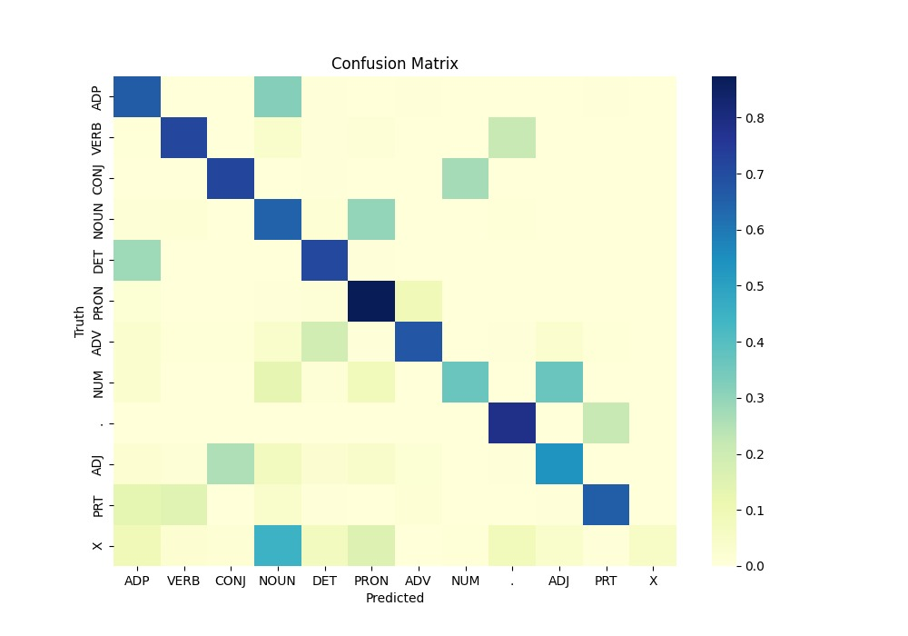

# CS563-NLP | Assignment 1
Submitted by - 
- Sanskriti Singh
- 2001CS60

## Problem Statement

- The assignment targets to implement Hidden Markov Model (HMM) to perform Part-of-Speech (PoS) tagging task

## Data

- Dataset consists of sentences and each word is tagged with its corresponding PoS tag
- Brown dataset: `Brown_train.txt`
- Format of dataset:
    - Each line contains `<Word/Tag> `(word followed by ‘/’ and tag)
    - Sentences are separated by a new line

### Preprocessing

- Each sentence was padded by `<start>` and `<end>` tokens with `START` and `END` tags
- Data was prepared by separating `tokens` and `tags`

## HMM Model

- HMM model had various parts, as discussed below

### States

- Bigram
    - Single tags are used as the `states`

- Trigram
    - Pair of tags are used as `states`

### Observations

- total `tokens` observed in train set is the `observations`

### Start Probability

- Calculation of the probability of each `state` to occur at the start of the sentence
- A linear array of probabilities for each `state`

```
Bigram start probability
{'START': 0.04596150341647565, 'ADP': 0.0, 'DET': 0.0, 'NOUN': 0.0, 'VERB': 0.0, 'ADJ': 0.0, 'CONJ': 0.0, 'PRT': 0.0, '.': 0.0, 'END': 0.0, 'ADV': 0.0, 'NUM': 0.0, 'PRON': 0.0, 'X': 0.0}
```

### Transition Probability

- Calculation of probability of moving from one `state` to another
- A 2D matrix containing probabilities of States VS States

```
Bigram transition probability
          START       ADP       DET      NOUN      VERB       ADJ      CONJ       PRT         .  END       ADV       NUM      PRON         X
START  0.000000  0.000000  0.000000  0.000000  0.000000  0.000000  0.000000  0.000000  0.000000    0  0.000000  0.000000  0.000000  0.000000
ADP    0.106617  0.020877  0.008834  0.242585  0.166021  0.091812  0.072333  0.100627  0.061142    0  0.139616  0.130102  0.053583  0.042373
DET    0.193336  0.464676  0.005383  0.016014  0.152920  0.006225  0.143371  0.082192  0.066550    0  0.066250  0.013505  0.018142  0.006780
NOUN   0.126296  0.241448  0.643088  0.133692  0.091560  0.633741  0.217166  0.031366  0.074852    0  0.029838  0.371549  0.009365  0.062712
VERB   0.037649  0.040889  0.067950  0.171359  0.182920  0.017989  0.218854  0.580207  0.076067    0  0.228010  0.045918  0.694737  0.071186
```

### Emission Probability

- Probability of an `observation` being a particular `state`
- A 2D matrix containing Probabilities of Observations VS States

```
Bigram emission probability
         START       ADP       DET      NOUN      VERB  ADJ  CONJ  PRT    .  END       ADV  NUM      PRON    X
<start>    1.0  0.000000  0.000000  0.000000  0.000000  0.0   0.0  0.0  0.0  0.0  0.000000  0.0  0.000000  0.0
at         0.0  0.040009  0.000000  0.000000  0.000000  0.0   0.0  0.0  0.0  0.0  0.000000  0.0  0.000000  0.0
that       0.0  0.042681  0.019711  0.000000  0.000000  0.0   0.0  0.0  0.0  0.0  0.001264  0.0  0.025084  0.0
time       0.0  0.000000  0.000000  0.006541  0.000011  0.0   0.0  0.0  0.0  0.0  0.000000  0.0  0.000000  0.0
highway    0.0  0.000000  0.000000  0.000141  0.000000  0.0   0.0  0.0  0.0  0.0  0.000000  0.0  0.000000  0.0

```

## Testing and Results

- Model was tested using 5 Fold Cross Validation Method 

### Bigram

- Accuracy of the model was calculated for each testing set
- Confusion matrix was calculated as States VS States

#### Accuracy

```
Round 1: 0.9422294928721664
Round 2: 0.9437136807964323
Round 3: 0.942971980513673
Round 4: 0.9357937270901232
Round 5: 0.9312093083883892
```

#### Confusion Matrix



### Trigram

#### Accuracy

```
Round 1: 0.9357677027342837
Round 2: 0.9369228343619082
Round 3: 0.935659347018655
Round 4: 0.9332145341430436
Round 5: 0.9270792598843312
```

#### Confusion Matrix

